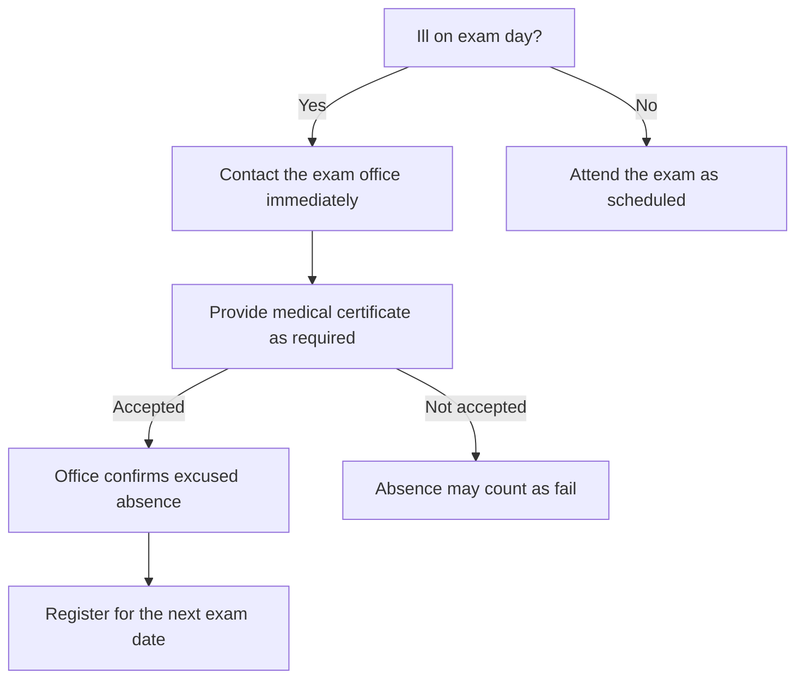

:::artifact{identifier="exam-illness-decision-tree" type="text/markdown" title="Exam Illness Decision Tree"}
```md
## Exam day illness: decision tree



**Notes**
- Always verify deadlines and document requirements in the official regulation.
```
:::
