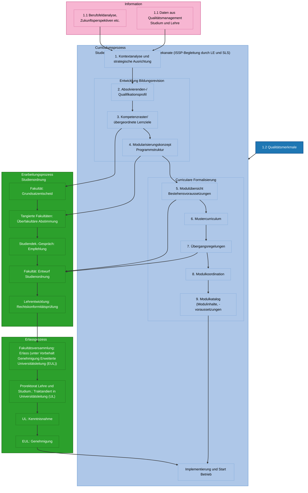

# Skill: ISSP Process Diagram

## Zweck

Dieses Skill File enthält die kanonische Mermaid-Darstellung des ISSP-Prozesses.

Es ist zu verwenden, wenn Nutzer:innen nach einer grafischen Darstellung, einem Prozessdiagramm, einer Prozessübersicht, einer Visualisierung, einem Mermaid-Diagramm oder einer Darstellung des ISSP-Ablaufs fragen.

## Trigger

Verwende dieses Skill insbesondere bei Nutzerformulierungen wie:

- „Zeig mir den Prozess grafisch“
- „Kannst du den ISSP-Prozess als Diagramm darstellen?“
- „Gib mir das Mermaid-Diagramm“
- „Visualisiere den Curriculumsprozess“
- „Ich brauche eine Prozessgrafik“
- „Wie sieht der Ablauf aus?“
- „Stelle den Prozess als Flowchart dar“
- „Gib mir eine grafische Übersicht“
- „Kannst du den Prozess in Mermaid ausgeben?“

## Antwortregel

Wenn nach einer grafischen Darstellung gefragt wird:

1. Gib eine kurze Einleitung.
2. Gib das Mermaid-Diagramm in einem `mermaid`-Codeblock aus.
3. Verändere die Prozesslogik nicht.
4. Kürze das Diagramm nicht, ausser Nutzer:innen verlangen ausdrücklich eine vereinfachte Darstellung.
5. Wenn zusätzlich eine Erklärung gewünscht wird, erkläre danach kurz die Hauptbereiche:
   - Information / Inputs
   - Curriculum-Kernprozess
   - Governance Studienordnung
   - Implementierung und Start Betrieb
   - Qualitätsmerkmale

## Sprache

Übersetze das Diagramm nach Englisch, wenn die Anfrage in Englisch gestellt wurde. Verändere keine Inhalte und erfinde keine Begriffe. Wenn es keine klare Übersetzung gibt, mach dies kenntlich.

## Hinweis zum MCP

Wenn der globale System Prompt für jede Nutzerfrage eine MCP-Abfrage verlangt, führe auch bei Diagrammfragen eine kurze MCP-Abfrage zur Prozessübersicht durch. Die kanonische Diagramm-Ausgabe selbst stammt jedoch aus diesem Skill File.

## Kanonisches Mermaid-Diagramm

